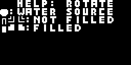
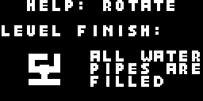
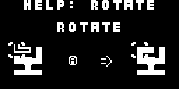
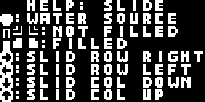
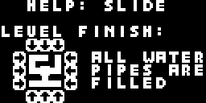
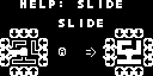
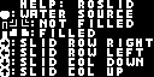
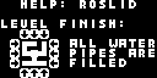
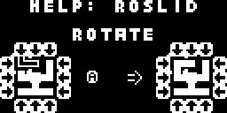
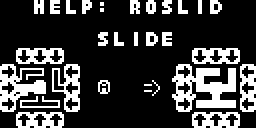

# Waternet Multiplatform Retro Game
This is the Arduboy version of my Waternet games which is a multiplatform puzzle game initially written for old consoles and handhelds like Game Boy (Color), Game Gear, Master System, Analogue Pocket and Mega Duck using the gbdk sdk. This a port with many changes to make it work for arduboy 

## Buy me a "koffie" if you feel like supporting 
I do everything in my spare time for free, if you feel something aided you and you want to support me, you can always buy me a "koffie" as we say in dutch, no obligations whatsoever...

## Controls
| Button    | Action                                                                   |
|-----------|--------------------------------------------------------------------------|
| A / Start | Confirm in menu and level selector, rotate or slide action while playing |
| B         | Back in menu, level selector and game                                    |

## Game Modes
The aim of the game, in any game mode is always to connect all pipes so that water can flow through them from the water point source. How you can accomplish this depends on the  game mode. The game has a help section in the main menu where you can always check up on the rules of each game mode.

### Rotate Mode
|  |  |  |
| ------ | ------ | ------ |

You need to connect all the pipes so water flows through them, by pressing the A button on a pipe, to rotate the single pipe.

### Slide Mode
|  |  |  |
| ------ | ------ | ------ |

You need to connect all the pipes so water flows through them, by pressing the A on the arrows of a row or column. The row or column will move all pipes in the direction the arrow is pointing at.

### Roslid Mode
|  |  |  |  |
| ------ | ------ | ------ | ------ |

You need to connect all the pipes so water flows through them, by pressing the A on the arrows of a row or column. The row or column will move all pipes in the direction the arrow is pointing at. You can also press the A on a pipe, to rotate the single pipe. This is a combination Rotate and Slide mode.

## Arduboy FX bootloader menu image

## Graphics 
Graphics (tiles), i converted using the [Gimp Image Editor](https://www.gimp.org/) and the [Gimp tilemap gb plugin](https://github.com/bbbbbr/gimp-tilemap-gb) from the gameboy tiles created in [Game Boy Tile Designer](http://www.devrs.com/gb/hmgd/gbtd.html) and the titlescreen graphic is based on a modified title screen image from my waternet game i made for [gp2x](https://www.willemssoft.be/index.php?main=5&sub=6&action=productdetails&id=218) and [windows](https://www.willemssoft.be/index.php?main=46&sub=7&action=productdetails&id=220). I designed the title screen in the [Gimp Image Editor](https://www.gimp.org/) to just have the word waternet and the waterdrop. Afterwards i used Team ARG [Cabi](https://github.com/Team-ARG-Museum/Cabi) to convert the titlescreen to an RLE encoded bitmap as a constant. 

## Sound
Sound are single tones generated using the beepin2 class from [Arduboy2](https://github.com/MLXXXp/Arduboy2) library

## Music
Music was made using [Online Sequencer](https://onlinesequencer.net/), i created single channel, non mixed music files and later converted this music to an array storing the frequencies of notes to be used on the arduboy. I got [this idea](https://www.gamedeveloper.com/programming/making-a-game-boy-game-in-2017-a-quot-sheep-it-up-quot-post-mortem-part-2-2-) from the [sheep it up](https://gamejolt.com/games/sheepitup/267335) game developed by Dr. Ludos. He stored the frequencies to be used for the music notes in a array. So i used the same system and all i had todo was convert the music from onlinesequencer i made to such array (by hand) as well.
The music is played using the [Arduboy tones library](https://github.com/MLXXXp/ArduboyTones)

You can find the music files i used for the game below:

* Game Music: [https://onlinesequencer.net/2485064](https://onlinesequencer.net/2485064)
* Title Music: [https://onlinesequencer.net/2484977](https://onlinesequencer.net/2484977)
* Level Done Tune: [https://onlinesequencer.net/2484974](https://onlinesequencer.net/2484974)

## EEPROM
The game uses EEPROM for saving it's progress, you can find and change these values in [savestate.cpp](source/waternet/src/savestate.cpp)

| Start address | End address | Bytes used |
| ------------- | ----------- | ---------- |
| 493           | 505         | 13         |

## Photo's of the game running on real hardware

|  |  |  |  |  |
| ------ | ------ | ------ | ------ | ------ |

## Credits
Waternet game concept is based on the Net and Netslide game from the [Simon Tatham's Portable Puzzle Collection](https://www.chiark.greenend.org.uk/~sgtatham/puzzles/),
it's my own implementation of these 2 game concepts mixed into one game

### Libraries used
* Arduboy2 - [https://github.com/MLXXXp/Arduboy2](https://github.com/MLXXXp/Arduboy2)
* Arduboy tones - [https://github.com/MLXXXp/ArduboyTones](https://github.com/MLXXXp/ArduboyTones)

### Tools used:
* Arduino ide / compiler - [https://www.arduino.cc/en/software](https://www.arduino.cc/en/software) 
* Visual Studio Code - [https://code.visualstudio.com/](https://code.visualstudio.com/)
* Arduino VS Code plugin - [https://github.com/microsoft/vscode-arduino](https://github.com/microsoft/vscode-arduino)
* ProjectABE - [https://github.com/felipemanga/ProjectABE](https://github.com/felipemanga/ProjectABE)
* Team Arg Cabi - [https://github.com/Team-ARG-Museum/Cabi](https://github.com/Team-ARG-Museum/Cabi)
* Game Boy Tile Designer - [http://www.devrs.com/gb/hmgd/gbtd.html](http://www.devrs.com/gb/hmgd/gbtd.html)
* Gimp GB Tilemap & Tile plugin - [https://github.com/bbbbbr/gimp-tilemap-gb](https://github.com/bbbbbr/gimp-tilemap-gb)
* Gimp Image Editor - [https://www.gimp.org/](https://www.gimp.org/)
* Online Sequencer - [https://onlinesequencer.net/](https://onlinesequencer.net/)
